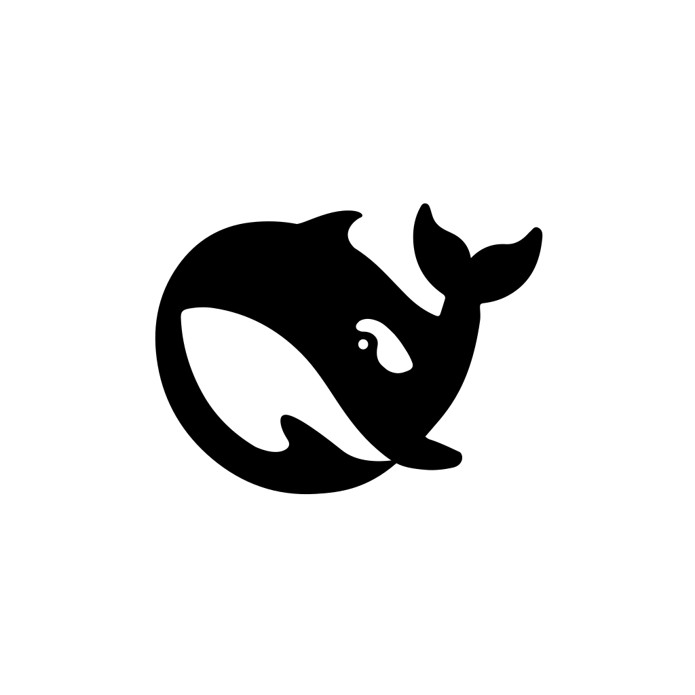
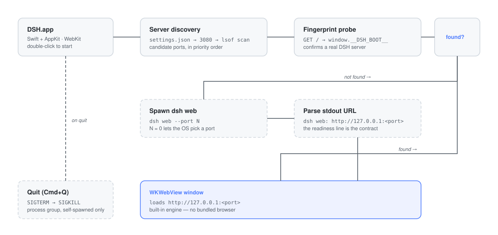

# DeepSeek Harness GUI

[English](README.md) · 中文

<p align="center">
  
</p>

<p align="center">
  <b><a href="https://github.com/deepseek-ai/deepseek-harness">DeepSeek Harness</a> 的原生 macOS 桌面客户端</b><br>
  双击图标即用 — 零依赖，不捆绑浏览器内核。
</p>

<p align="center">
  
  
  
  
  <a href="https://github.com/topics/dsh-plugin"></a>
</p>



## 特性

- ⚡ **零依赖** — 纯 Swift 调用系统 WebKit 内核，仅需 Xcode CommandLineTools 即可构建。无 Node、无 Electron、无 Chromium（二进制约 180KB）。
- 🔍 **自动发现服务** — settings.json → 端口 3080 → `lsof` 扫描运行中的 dsh 进程，并用 `window.__DSH_BOOT__` 指纹逐一确认。
- 🚀 **找不到就自起** — 拉起 `dsh web --port N`（N=0 时由系统分配端口），从就绪行 `dsh web: http://127.0.0.1:<port>` 解析真实地址。
- 🧹 **诚实的生命周期** — 退出时只终止自己启动的服务（SIGTERM → SIGKILL，按进程组）；启动前已在运行的服务零干预。
- 🐋 **官方品牌** — App 图标取自 DSH 官方黑鲸鱼（从自带 favicon 渲染）。
- ⚙️ **无头配置** — `settings.json` 控制端口/URL、工作目录（`cwd`）、dsh 路径与窗口尺寸。
- 🔁 **抗故障** — 30 秒启动超时、最多 2 次自动重连、错误页含重试按钮、完整日志 `~/Library/Logs/dsh-gui.log`。

## 快速开始

环境要求：macOS 14+、Xcode CommandLineTools（`xcode-select --install`）、PATH 中有 `dsh`（或配置 `dshPath`）。

```sh
git clone https://github.com/chentao326/dsh-gui.git
cd dsh-gui
bash build.sh          # 构建并安装 DSH.app 到 ~/Desktop
```

也可直接复制预构建产物 `build/DSH.app` 到 `/Applications`。

运行测试：

```sh
bash build.sh --test   # 单元 + 服务拉起集成测试
```

菜单快捷键：`Cmd+R` 重新加载 · `Cmd+Shift+O` 在浏览器中打开 · `Cmd+Q` 退出。

## 与其他桌面端的对比

| | **本项目** | [salathleizhang/deepseek-harness-desktop](https://github.com/salathleizhang/deepseek-harness-desktop) | [anywhere-labs/deepseek-harness-desktop](https://github.com/anywhere-labs/deepseek-harness-desktop) |
|---|---|---|---|
| 技术栈 | Swift + 系统 WebKit | Electron（Chromium） | Electron |
| 运行时依赖 | **零** | 捆绑 Node + Chromium（约 100MB+） | 捆绑 Node + Chromium |
| 安装包体积 | 二进制约 180KB | 数百 MB 级 DMG | 安装包 |
| 构建方式 | `bash build.sh`，约 30 秒，仅需 CLT | pnpm / electron-builder | pnpm / electron-builder |
| 平台 | macOS（arm64；Intel 可交叉编译） | macOS + Windows（签名/公证） | macOS + Windows |
| 服务启动 | 先发现，找不到才自起；`--port 0` + stdout 解析 | 固定 spawn，等待就绪行 | 托管服务 + 系统托盘 |
| 退出语义 | 只终止自己启动的服务 | 拥有 shutdown 与崩溃重启 | 集成管理（托盘） |
| 配置 | `settings.json`（端口/URL/cwd/dshPath/窗口） | — | — |

一句话：**Electron 系把 Chromium 搬进来、面向下载分发；本项目几百 KB 可逐行审查的 Swift，面向源码构建**。

## 配置（可选）

`~/Library/Application Support/DSH GUI/settings.json`：

```json
{
  "port": 8080,
  "url": "http://127.0.0.1:8080",
  "cwd": "/path/to/project",
  "dshPath": "/path/to/dsh",
  "windowWidth": 1280,
  "windowHeight": 800
}
```

| 键 | 作用 |
|---|---|
| `port` / `url` | 跳过自动发现直接连接（url 优先） |
| `cwd` | 自起服务的工作目录（dsh 的默认文件系统位置）；默认 `$HOME` |
| `dshPath` | 显式指定 dsh CLI；默认按 `which dsh` → 最新 `~/.npm/_npx/*/.../dsh/lib/bin.js` 定位 |
| `windowWidth` / `windowHeight` | 窗口初始尺寸 |

## 日志

`~/Library/Logs/dsh-gui.log` — 启动、连接、终止事件与 dsh 子进程输出。

## 常见问题

**提示找不到 `dsh` 怎么办？**
先安装：`npm install -g @deepseek-ai/dsh`；或在 `dshPath` 指向你的源码检出的 `lib/bin.js`。

**3080 端口被别的程序占了？**
App 会先探测 3080；若占用者不是 DSH，则改用 `--port 0` 随机端口并从 stdout 发现真实地址，无需手动处理。

**服务本来就在运行，退出 App 会杀掉它吗？**
不会。只有 App 自己启动的服务才会被终止；外部服务保持运行（日志只有 `connected to …`，无终止记录）。

**Intel Mac 能跑吗？**
随附二进制为 arm64；可用 `swiftc -target x86_64-apple-macos13.0` 交叉编译（SDK 支持）。

## 文档

- 设计规格：`docs/superpowers/specs/2025-08-14-dsh-gui-design.md`
- 实现计划：`docs/superpowers/plans/2025-08-14-dsh-gui.md`

## 许可与发现

[MIT](LICENSE) © chentao326。

依据官方 [DeepSeek Harness README](https://github.com/deepseek-ai/deepseek-harness) 的建议：给你的插件仓库加上 [`dsh-plugin`](https://github.com/topics/dsh-plugin) topic 以便被发现——本仓库已按此标记。
